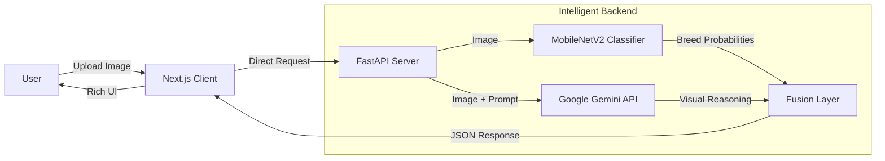

# 🐾 PawSense - Intelligent Dog Breed Expert


> **"More than just a breed classifier. It's an AI that *sees* and *understands* your dog."**

## Introduction

**PawSense** is a next-generation AI application that bridges the gap between pet owners and canine knowledge. Unlike traditional classifiers that simply output a label, PawSense offers a dual-layer analysis system:

1.  **Instant Identification**: Uses an on-device optimized **MobileNetV2** model to instantly recognize breeds with high speed and efficiency.
2.  **Deep Visual Reasoning**: leverages **Google's Gemini 2.5 Flash** (Vision-Language Model) to "see" the image, explain *why* it made a prediction, and answer specific questions like *"Is this dog overweight?"* or *"What creates this unique coat pattern?"*.

Whether you're a shelter volunteer trying to identify a mixed breed or a dog lover curious about your furry friend, PawSense provides expert-level insights in seconds.

---

##  Key Features

###  **1. Dual-Mode Analysis**
*   **Basic Mode**: Ultra-fast breed identification using a lightweight Convolutional Neural Network (CNN). Perfect for quick checks.
*   **Advanced Mode**: Deep analysis using state-of-the-art Generative AI to provide detailed descriptions and confidence assessments.

###  **2. Visual Reasoning Engine**
*   **"Why this breed?"**: The AI explains its decision by pointing out specific physical traits (e.g., *"The square muzzle and muscular build indicate a Boxer mix"*).
*   **Comparative Analysis**: Confused between two lookalikes? PawSense explains the subtle differences found in your specific photo.

###  **3. Interactive "Ask the Dog"**
*   Chat with your image! Ask questions like:
    *   *"Is the environment safe for this puppy?"*
    *   *"What is the approximate age of this dog?"*
    *   *"Does this dog look happy or stressed?"*

---

##  Tech Stack & Architecture

### **The "Brain" (AI Models)**

| Component | Technology | Role |
|-----------|------------|------|
| **Primary Classifier** | **MobileNetV2** | Lightweight CNN for fast, local breed classification (runs on CPU). |
| **Visual Reasoning** | **Google Gemini 2.5 Flash** | VLM that provides natural language descriptions and Q&A capabilities. |
| **Backend API** | **FastAPI (Python)** | High-performance async API server handling model orchestration. |
| **Vector Search** | **In-Memory** | Efficient filtering to ensure only valid dog breeds are processed. |

### **The "Body" (Application)**

*   **Frontend**: [Next.js 14](https://nextjs.org/) (App Router), [TypeScript](https://www.typescriptlang.org/), [Tailwind CSS](https://tailwindcss.com/), [Shadcn/ui](https://ui.shadcn.com/).
*   **Deployment**: 
    *   **Frontend**: Vercel (Edge Network)
    *   **Backend**: Render (Python Environment)

### **System Architecture**



---

## � Project Structure

A clean, modular monorepo structure separating concerns between client and server.

```
pawSense/
├── frontend/                 # Next.js Application
│   ├── app/                  # App Router & Pages
│   │   ├── analyzer/         # Main Analysis Wizard Logic
│   │   └── page.tsx          # Landing Page
│   ├── components/ui/        # Reusable Shadcn Components
│   └── lib/                  # Utilities & Helpers
│
├── backend/                  # Python API Server
│   ├── app/
│   │   ├── api/routes.py     # API Endpoints
│   │   ├── models/           # MobileNetV2 Loading Logic
│   │   ├── services/         # Prediction Orchestration
│   │   └── utils/            # Breed Info Helpers
│   ├── vlm_extension.py      # Google Gemini VLM Integration
│   └── requirements.txt      # Python Dependencies
│
└── README.md                 # Project Overview
```

---

## 🚀 Getting Started

Follow these steps to set up PawSense locally.

### Prerequisites
*   **Node.js 18+**
*   **Python 3.10+**
*   **Google Gemini API Key** (Get one for free at [aistudio.google.com](https://aistudio.google.com/))

### 1. Backend Setup (Python)

```bash
# Navigate to backend
cd backend

# Create virtual environment
python -m venv venv
source venv/bin/activate  # Windows: venv\Scripts\activate

# Install dependencies
pip install -r requirements.txt

# Create .env file
echo "GOOGLE_GEMINI_API_KEY=your_api_key_here" > .env
echo "ALLOWED_ORIGINS=http://localhost:3000" >> .env

# Download the lightweight model (MobileNetV2)
python download_models.py

# Start the server
python -m uvicorn app.main:app --reload
```
*Server runs at `http://localhost:8000`*

### 2. Frontend Setup (Next.js)

```bash
# Navigate to frontend
cd ../frontend

# Install dependencies
npm install

# Configure environment
echo "NEXT_PUBLIC_API_URL=http://localhost:8000" > .env.local

# Start development server
npm run dev
```
*App runs at `http://localhost:3000`*
