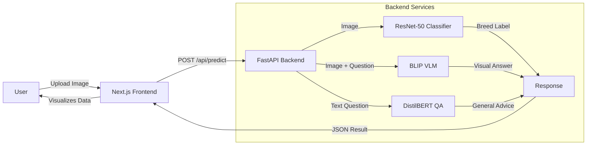

<<<<<<< Updated upstream
# PawSense - Dog Breed Identification with AI 
=======
# 🐾 PawSense - Intelligent Dog Breed Analyzer
>>>>>>> Stashed changes

> **Where Computer Vision meets Canine Companionship.** 
> A distinct AI-powered application that not only identifies dog breeds but *understands* them through visual reasoning and interactive dialogue.


---

## 📖 Introduction

**PawSense** is a full-stack AI application designed to bridge the gap between humans and dogs. Unlike standard breed classifiers that simple output a label, PawSense provides a **comprehensive analysis**.

It combines traditional **Computer Vision** (for high-accuracy classification) with modern **Vision-Language Models (VLM)** to answer questions about the specific dog in the photo, and **Natural Language Processing (NLP)** to provide general expert advice.

Whether you're trying to identify a mystery rescue dog or just want to learn more about a furry friend, PawSense is your intelligent guide.

---

## 🤖 AI Models (The "Brain")

PawSense runs on a trio of specialized AI models, orchestrated by a FastAPI backend:

| Capability | Model Used | Purpose |
|------------|------------|---------|
| **Breed Classification** | `microsoft/resnet-50` | A powerful Convolutional Neural Network (CNN) fine-tuned to recognize visual patterns of dog breeds with high precision. |
| **Visual Reasoning (VLM)** | `Salesforce/blip-vqa-base` | A Vision-Language Model that "sees" the image and can answer specific questions like "What color is the dog's collar?" or "Does it look happy?". |
| **General Knowledge (QA)** | `distilbert-base-cased-distilled-squad` | A lightweight, fast Transformer model that answers general requests like "Are Golden Retrievers good with kids?" using a curated knowledge base. |

> **Note**: These models are optimized for performance. The heavy VLM models are "lazy-loaded" (only loaded when you specifically request deep analysis) to keep the server lightweight and fast.

---

## 🛠️ Tech Stack

### **Frontend (The Experience)**
- **Framework**: [Next.js 14](https://nextjs.org/) (App Router) - For server-side rendering and swift routing.
- **Styling**: [Tailwind CSS](https://tailwindcss.com/) - For a beautiful, responsive, mobile-first design system.
- **Components**: [shadcn/ui](https://ui.shadcn.com/) - Built on generic Radix UI primitives for accessibility.
- **Animations**: CSS transitions & Framer Motion concepts for a delightful "Pacific Blue" aesthetic.
- **State Management**: React Hooks (Custom hooks for file handling and API communication).

### **Backend (The Intelligence)**
- **Framework**: [FastAPI](https://fastapi.tiangolo.com/) - High-performance, async Python web framework.
- **ML Engine**: [PyTorch](https://pytorch.org/) & [Hugging Face Transformers](https://huggingface.co/docs/transformers/index).
- **Image Processing**: [Pillow (PIL)](https://python-pillow.org/) - For robust image manipulation and validation.
- **Server**: Uvicorn (ASGI) - For handling concurrent requests efficiently.

---

## 🏗️ System Architecture

Processing happens in a privacy-first manner. Images are processed in-memory and never permanently stored.



---

## ✨ Key Features

### 🔍 **1. Intelligent Identification**
- Instantly detects dog breeds with confidence scores.
- Handles complex backgrounds and lighting conditions robustly.

### 🧠 **2. Visual Reasoning**
- Goes beyond simple labels.
- Explains *why* a dog is identified as a certain breed based on visual features (ears, snout shape, coat pattern).
- Can perform comparative reasoning (e.g., "This looks like a mix of...").

### 💬 **3. Interactive "Ask the Dog"**
- A chat interface where you can ask questions regarding the uploaded image.
- Examples: 
  - *"Is this dog overweight?"*
  - *"What creates this coat pattern?"*
  - *"Is the environment safe for this puppy?"*

### 🎨 **4. Premium UX Design**
- **Pacific Blue Theme**: A calming, trustworthy color palette designed for animal lovers.
- **Wizard Flow**: A guided, step-by-step analyzer interface that feels effortless.
- **Responsive**: Perfectly optimized for both desktop and mobile use.

---

## 📁 Project Structure

A clean, modular architecture separating concerns between client and server.

```
pawSense/
├── frontend/                 # Next.js Application
│   ├── app/                  # App Router Pages
│   │   ├── analyzer/         # Main Analyzer Wizard
│   │   ├── layout.tsx        # Global Layout
│   │   └── page.tsx          # Landing Page
│   ├── components/           # Reusable UI Components
│   ├── lib/                  # Utilities & Helpers
│   └── public/               # Static Assets
│
├── backend/                  # Python API Server
│   ├── app/
│   │   ├── api/              # API Routes (endpoints)
│   │   ├── models/           # Logic for loading AI models
│   │   ├── services/         # Business logic layer
│   │   └── config.py         # Configuration management
│   ├── tests/                # Unit tests
│   ├── vlm_extension.py      # Vision-Language Logic
│   └── download_models.py    # Setup utility
│
└── doc/                      # Documentation
    ├── ENV_CONFIGURATION_GUIDE.md  # Detailed Env Setup
    └── GITHUB_CLEANUP_GUIDE.md     # Maintenance Guide
```

---

## 🚀 Getting Started

### Prerequisites
- **Node.js** 18+
- **Python** 3.10+
- **Git**

### 1. Clone the Repository
```bash
git clone https://github.com/Avinash55o/pawSense.git
cd pawSense
```

### 2. Backend Setup
```bash
cd backend
python -m venv venv
source venv/bin/activate  # On Windows: venv\Scripts\activate
pip install -r requirements.txt

# Download the heavy AI models (approx 2GB total)
python download_models.py

# Start the server
python -m uvicorn app.main:app --reload
```
*The backend will run on `http://localhost:8000`*

### 3. Frontend Setup
```bash
cd ../frontend
npm install

# Create environment file
cp .env.local.example .env.local

# Run development server
npm run dev
```
*The frontend will run on `http://localhost:3000`*

---

## 🔮 Future Roadmap

We are constantly improving PawSense. Here is what's coming next:

### **Short Term (v1.1)**
- [ ] **Multi-Dog Detection**: Identifying multiple dogs in a single frame.
- [ ] **Export Results**: Download analysis as a PDF report.
- [ ] **Dark Mode**: Complete theme support for night-time usage.

### **Medium Term (v1.5)**
- [ ] **Adoption Matcher**: Connect identified breeds with local rescue centers.
- [ ] **Health Screening**: Preliminary visual check for common skin/eye issues (experimental).
- [ ] **User Accounts**: Save your analysis history.

### **Long Term (v2.0)**
- [ ] **Mobile App**: Native iOS/Android application using React Native.
- [ ] **Community API**: Public API for other developers to build on our model.

---

## 🤝 Contributing

We welcome contributions! Please check our [Issues](https://github.com/Avinash55o/pawSense/issues) page.

1. Fork the Project
2. Create your Feature Branch (`git checkout -b feature/AmazingFeature`)
3. Commit your Changes (`git commit -m 'Add some AmazingFeature'`)
4. Push to the Branch (`git push origin feature/AmazingFeature`)
5. Open a Pull Request

---

## 👨‍💻 Author

**Avinash Boruah**  
*Full Stack Developer & AI Enthusiast*

- 🌐 Portfolio: [avinashboruah.netlify.app](https://avinashboruah.netlify.app/)
- 🐙 GitHub: [@Avinash55o](https://github.com/Avinash55o)
- 💼 LinkedIn: [Avinash Boruah](https://linkedin.com/in/avinash-boruah)

---

> **Disclaimer**: PawSense is an AI tool and should not replace professional veterinary advice. DNA tests remain the only 100% accurate way to determine breed.

Made with ❤️ and 🐾 by Avinash.